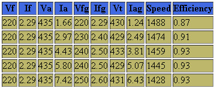
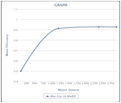

### Speed Control of Separately Excited DC Motor
 
1. Close the DPST (double pole single throw) switch on field supply of motor, increase the voltage till rated value is reached, in steps.
2. Now close DPST (double pole single throw) switch on armature supply of DC motor, apply rated voltage in steps.
There are two methods for speed control of DC motor.

### Armature control method :
3. Keeping field voltage constant at some value, vary the armature voltage the DC motor. Observe the speed readings on the tachometer.
4. The speed will vary proportionally in direct relation with armature voltage.

### Field Control Method:
5. Now keep armature voltage constant at some value, and reduce the voltage applied to the field of motor. Observe the speed readings on the tachometer.
6. As we go on reducing field voltage in steps, the speed of motor will go on increasing. This relation observes inverse proportion.
7. Store this data by clicking "Start Storing Data"
8. So to keep the voltage of generator constant at load condition adjust the field excitation of generator.
Now again increase the load by closing another load switch.
9. Store this data by clicking "Start Storing Data"
10. Go on repeating this procedure till all loads are connected and data is stored.
11. Now display the data by clicking "Show data". For Ex
 

 
* Vf=field voltage of DC motor
* If=field current of DC motor
* Va=armature voltage of DC motor
* Ia= armature current of DC motor
* Vfg= field voltage of generator
* Ifg=field current of generator
* Vt=terminal voltage
* Iag=armature current of generator

 

 
12. After experimentation, reduce armature voltage in steps to zero, then open armature DPST (double pole single throw) switch.
13. Now reduce field voltage step by step and then open field DPST (double pole single throw) switch when zero value is reached.

